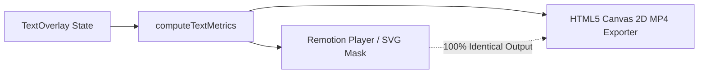

# 🎬 PromptVideo — AI Timeline Copilot

> **Conversational, prompt-driven video editing powered by Google Gemini 3.5 Flash Lite, Remotion, and a multi-track interactive timeline.**


---

## ✨ Overview

**PromptVideo** is an AI-powered web video editor that combines the precision of non-linear editors (NLE) with natural language editing. Type what you want to change, and Gemini's structured function calling engine translates your prompt into timeline mutations, animations, zooms, camera punch-ins, audio cuts, text styling, and multi-clip stitching in real time.

---

## 🚀 Key Features

### 1. 🤖 Conversational AI Timeline Copilot (Gemini 3.5 Flash Lite)
- **Natural Language Video Editing**: Prompt in plain English to insert text, cut dead air, punch in on speakers, configure animated subtitles, or add full-screen color cards.
- **Universal Timeline Mutability ("Editable by Default")**: Follow-up commands like *"Make it bigger"*, *"Move it to the bottom"*, or *"Change that zoom to 50%"* dynamically mutate existing elements without writing custom code or generating duplicate items.
- **Multi-Turn Context Awareness**: Understands context across successive conversational turns while protecting existing timeline elements.
- **Prompt Injection Defense**: Security guardrails isolate user input from system persona instructions.

### 2. 🎞️ Stackable Multi-Track Timeline
- **Unified Video Track with In-Track Cuts**: Eliminates cluttered secondary cut tracks. Cut segments appear directly on the Video Track with red diagonal hazard stripes (`✂ Cut [4.0s - 8.0s]`).
- **Interactive Drag-and-Drop**: Click and drag the body of any timeline block (video clips, cuts, text overlays, color screens, camera zooms) horizontally along the track to shift start and end timestamps simultaneously.
- **Dynamic Boundary Trimming**: Drag the left or right edge handles to expand or trim item durations with real-time timecode badge feedback.
- **Floating Receipt Popover**: Clicking any block opens a docked receipt popover with micro-adjustment buttons (`-0.2s / +0.2s`), live color pickers, text inputs, and deletion.

### 3. 🎯 Direct On-Frame Click & Drag
- **Video Preview Canvas Manipulation**: Click and drag text overlays directly on the video player frame.
- **Magnetic Snap Guides**: Automatically detects and snaps to horizontal center (50%), vertical center (50%), and lower-third / bottom center (82%).
- **Synchronized Coordinates**: Freeform positions (`posX`, `posY`) are preserved with 1:1 pixel parity between the live Remotion preview and MP4 export.

### 4. 📁 Media Bin & Multi-Video Stitching
- **Asset Upload Dropzone**: Drag and drop multiple video files with automatic client-side canvas thumbnail and duration generation.
- **One-Click & Conversational Stitching**: Append clips manually via `+ Stitch`, or ask the AI:
  > *"Stitch intro_founder.mp4 to the beginning of the video"*  
  > *"Add outro_cta.mp4 to the end"*

### 5. 🎨 Knockout Text & Full-Screen Screens
- **Inverted Knockout Text**: Solid backgrounds with transparent letter cutouts revealing the video playing inside the typography.
- **Full-Screen Solid Screens / Flashes**: Instantly insert white screens, black screens, or color flash cards (e.g. *"at the 10 sec mark add a white screen for 2 seconds"*).

### 6. ⚡ 1:1 Parity Client-Side MP4 Export
- **Pixel-Perfect Rendering**: Shared `computeTextMetrics` geometry guarantees that typography, padding, rounded corners, zooms, and knockout masks render identically in the live Remotion player and the exported MP4 file.
- **Pure Browser Canvas Export**: Uses frame-by-frame HTML5 Canvas 2D capture with `MediaRecorder` — no heavy backend rendering servers required.

---

## 🛠️ Tech Stack

- **Framework**: [Next.js 16 (Turbopack, App Router)](https://nextjs.org/)
- **Video Player**: [Remotion Player (`@remotion/player`)](https://www.remotion.dev/)
- **AI Model**: [Google Gemini 3.5 Flash Lite (`@google/genai`)](https://ai.google.dev/)
- **Styling**: [Tailwind CSS v4](https://tailwindcss.com/)
- **Icons**: [Lucide React](https://lucide.dev/)
- **Runtime & Package Manager**: [Bun](https://bun.sh/) / [Node.js](https://nodejs.org/)

---

## 📂 Project Structure

```
VideoEditor/
├── public/                     # Static media and sample video assets
├── src/
│   ├── app/
│   │   ├── api/edit/prompt/    # Gemini 3.5 function calling API endpoint & fallback parser
│   │   ├── layout.tsx          # Root layout with fonts
│   │   └── page.tsx            # Main studio dashboard (Media Bin + Player + Chat + Timeline)
│   ├── components/
│   │   ├── editor/
│   │   │   ├── MediaBin.tsx    # Multi-file asset dropzone & thumbnail generator
│   │   │   └── PromptInput.tsx # Gemini conversational input bar
│   │   ├── player/
│   │   │   ├── DraggableOverlayLayer.tsx # On-frame drag listener with snapping guides
│   │   │   ├── RemotionPlayer.tsx        # Responsive player wrapper & controls
│   │   │   └── VideoComposition.tsx      # Multi-clip Remotion composition & knockout masks
│   │   └── timeline/
│   │       ├── TimelineEditor.tsx        # Master multi-track timeline container & ruler
│   │       ├── TimelineTrack.tsx         # Track lane with drag-to-move & trim handles
│   │       └── TimelineReceiptPopover.tsx# Floating micro-adjustment popover
│   ├── composables/
│   │   ├── useVideoEditor.ts   # Core timeline state manager & generic CRUD operations
│   │   └── usePromptChat.ts    # Multi-turn chat history & API integration
│   ├── types/
│   │   ├── editor.ts           # VideoProjectState, VideoClip, MediaAsset, TextOverlay
│   │   └── api.ts              # Request/response payloads
│   └── utils/
│       ├── textRendering.ts    # Unified geometry computation for Remotion & Canvas
│       ├── exportVideo.ts      # HTML5 Canvas 2D frame-by-frame MP4 exporter
│       └── time.ts             # Timecode formatting utilities
├── .env.example                # Template for Gemini API key
└── package.json
```

---

## ⚡ Quick Start

### 1. Prerequisites
- [Bun](https://bun.sh/) (recommended) or [Node.js 20+](https://nodejs.org/)
- Google Gemini API Key from [Google AI Studio](https://aistudio.google.com/)

### 2. Clone and Install

```bash
git clone https://github.com/itsNairr/Remotion-AI-Video-Editor.git
cd Remotion-AI-Video-Editor

# Install dependencies with Bun
bun install
# or with npm
npm install
```

### 3. Configure Environment Variables

Create a `.env.local` file in the project root:

```bash
cp .env.example .env.local
```

Add your Gemini API key:

```env
GEMINI_API_KEY=your_gemini_api_key_here
```

### 4. Run Development Server

```bash
bun run dev
# or
npm run dev
```

Open [http://localhost:3000](http://localhost:3000) in your browser.

### 5. Build for Production

```bash
bun run build
bun run start
```

---

## 💬 Natural Language Prompt Cheatsheet

| Goal | Example Prompt |
| :--- | :--- |
| **Inverted Knockout Text** | `"Add inverted negative text that says EVSTRY make it full screen"` |
| **Move / Reposition Text** | `"Move it to the bottom"` or `"Place it at top center"` |
| **Resize Text** | `"Make the text a little bigger"` or `"Change font size to 64px"` |
| **Full-Screen White/Black Screen** | `"At the 10 sec mark add a white screen for 2 seconds"` |
| **Camera Punch-In / Zoom** | `"Zoom in 25% on the speaker"` or `"Make that zoom 60% instead"` |
| **Trim Dead Air / Cut** | `"Cut dead air from 00:04 to 00:08"` or `"Extend that cut to 10 seconds"` |
| **Stitch Additional Video** | `"Stitch intro_founder.mp4 to the beginning of the video"` |
| **Animated Subtitles** | `"Add karaoke bounce subtitles with yellow highlight"` |
| **Undo / Remove** | `"Remove the zoom"` or `"Delete the last cut"` |

---

## 🛡️ Architecture & Parity Guarantee

### How 1:1 Visual Parity Works
Traditional web video editors often suffer from discrepancies between CSS-rendered HTML preview elements and the exported video. **PromptVideo** solves this by routing all overlay layout calculations through a single mathematical pipeline:



1. **`computeTextMetrics(overlay, width, height)`**: Calculates exact pixel coordinates, font metrics, box bounds, and margins based on either normalized freeform coordinates (`posX`, `posY`) or semantic anchors (`placement`).
2. **Remotion Composition**: Directly applies computed dimensions and styles to CSS and SVG knockout mask nodes.
3. **Canvas 2D Exporter**: Draws identical bounding rectangles, roundRect radii, knockout cutouts, and fonts frame by frame.

---

## 📄 License

MIT License. Feel free to use, modify, and distribute for personal or commercial projects.
