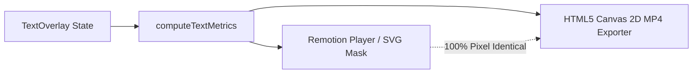

# 🎬 PromptVideo — AI Timeline Copilot

> **Conversational, prompt-driven video editing powered by Google Gemini 3.5 Flash Lite, Remotion, and a stackable multi-track timeline.**  
> *Granular, non-destructive, natural language video editing — bridging the gap between pro NLEs and generative AI.*


---

## 💡 Why PromptVideo? The Granular Editing Paradigm

Most video editing tools today fall into one of two extremes:

1. **Traditional Non-Linear Editors (Adobe Premiere Pro, Final Cut, DaVinci Resolve)**:
   - Exceptionally granular and surgical, but require deep manual operation: navigating dense menus, razor blades, keyframe bezier curves, inspector panels, and complex multi-track layers.
   - While Adobe has introduced isolated AI features (such as transcript-based text deletions, audio speech enhancement, and Firefly generative extend), **Adobe does not offer a natural language conversational copilot that directly orchestrates your timeline**. You cannot type: *"Split the clip at 04:20, punch in 30% on the speaker, add a 1-second white flash at the transition, and nudge the title to the lower-third"* and watch the timeline state mutate in real time.

2. **Template / Generative Video Platforms (Canva, CapCut, Runway, Sora, Pika)**:
   - **Canva / CapCut**: Excel at high-level template layouts, auto-captions, and macro AI magic tools (background removal, beat matching, text-to-image). However, they **do not provide an LLM agent that performs granular, conversational timeline surgery** on your raw media.
   - **Text-to-Video Generators (Runway, Sora, Pika)**: Treat video as a generative "black box" that creates synthetic pixels from scratch. They cannot perform surgical, deterministic, non-destructive editing on your existing footage.

### 🎯 The Missing Layer: Natural Language Powered Granular Editing

**PromptVideo** occupies the rare sweet spot: **Conversational Granular NLE**.

Instead of replacing the timeline with generative video or burying you under complex toolbars, PromptVideo pairs an interactive, multi-track Remotion timeline with an intelligent AI Copilot. Gemini 3.5 Flash Lite acts as an expert assistant editor that translates natural language prompts directly into deterministic timeline AST mutations (cuts, splits, zooms, overlays, track stacking, color flashes, audio cuts).

```
┌─────────────────────────────────────────────────────────────────────────────────────────┐
│                                   THE VIDEO EDITING SPECTRUM                           │
│                                                                                         │
│  Traditional NLEs              Black-Box AI               Template Apps     PromptVideo │
│  (Adobe Premiere)            (Sora, Runway)                 (Canva)                     │
│  ─────────────────           ──────────────               ─────────────     ─────────── │
│  • Manual razor tools        • Generates new pixels       • Preset templates • Natural language  │
│  • Steep learning curve      • Zero surgical control      • High-level macro • Surgical timeline│
│  • Isolated AI plugins       • Non-deterministic          • No conversation  • Stacked tracks   │
│  • No conversational agent   • Expensive re-renders       • Limited micro-ops• 1:1 Parity export│
└─────────────────────────────────────────────────────────────────────────────────────────┘
```

### ⚖️ Feature Comparison Matrix

| Feature / Capability | Adobe Premiere Pro | Canva Video | Gen-AI (Runway / Sora) | **PromptVideo** |
| :--- | :---: | :---: | :---: | :---: |
| **Conversational Timeline Copilot** | ❌ No | ❌ No | ❌ No (Prompt-to-pixel only) | **✅ Yes (Gemini 3.5 Flash Lite)** |
| **Natural Language Granular Slicing** | ❌ Manual Razor / Transcript | ❌ Manual Split | ❌ Inapplicable | **✅ Yes (e.g. *"Split at 4.2s and cut dead air"* )** |
| **Universal Follow-Up Mutability** | ❌ Manual Inspector | ❌ Manual Sliders | ❌ Must re-generate whole video | **✅ Yes (*"Make it bigger"*, *"Move to bottom"* )** |
| **Camera Punch-Ins / Zooms via Prompt** | ❌ Manual Keyframes | ❌ Preset Animations | ❌ Camera motion prompts only | **✅ Yes (*"Zoom in 25% on speaker"* )** |
| **Stackable Multi-Track Timeline** | ✅ Pro Tracks (Manual) | ⚠️ Basic Layering | ❌ No timeline | **✅ Full Stack (V1-V2, T1-T2, Z1-Z2)** |
| **Direct Canvas Manipulation + Snapping** | ⚠️ Complex wireframes | ✅ Drag & Drop | ❌ None | **✅ Drag + Magnetic Snap (Center, 82%)** |
| **1:1 Client-Side Browser MP4 Export** | ❌ Server / Local Render Engine | ⚠️ Server Cloud Render | ⚠️ Cloud Generation | **✅ Pure Canvas 2D + MediaRecorder** |
| **Zero Backend Overhead** | ❌ Desktop App | ❌ Cloud Backend | ❌ Cloud GPU Compute | **✅ 100% Client-Side Engine** |

---

## 🚀 Key Features

### 1. 🤖 Conversational AI Timeline Copilot (Gemini 3.5 Flash Lite)
- **Natural Language Video Editing**: Prompt in plain English to insert text, cut dead air, punch in on speakers, configure animated subtitles, split clips, or add full-screen color cards.
- **Universal Timeline Mutability ("Editable by Default")**: Follow-up commands like *"Make it bigger"*, *"Move it to the bottom"*, *"Change that zoom to 50%"*, or *"Shift the white screen by 2 seconds"* dynamically mutate existing elements without creating duplicate items.
- **Dual-Engine Execution**:
  - **Google Gemini 3.5 Flash Lite**: Structured function calling tool declarations (`add_text`, `add_screen`, `stitch_video`, `split_video`, `update_element`, `cut_segment`, `camera_zoom`, `configure_subtitles`, `remove_element`).
  - **Instant Fallback Parser**: Built-in regex engine handles common edit commands instantly even without an API key or when offline.
- **Multi-Turn Context Awareness**: Maintains full conversation history, tracking active playhead position and timeline inventory across successive prompts.
- **Prompt Injection Defense**: Strict security guardrails isolate user input from system persona instructions.

### 2. 🎞️ Stackable Multi-Track Timeline
- **Multi-Track Video Lanes (V1, V2)**: Primary footage on V1, B-roll cutaways and picture-in-picture overlays on V2. Add or remove tracks dynamically.
- **Stacked Text & Screens Lanes (T1, T2)**: Place full-screen color cards or lower-thirds on T1 while layering secondary text overlays on T2 so titles always remain visible.
- **Dedicated Zoom Lanes (Z1, Z2)**: Visualize and stack camera punch-in intervals with clear anchor and scale indicators.
- **In-Track Razor Splitting (`S` Shortcut)**: Click the **Split** razor button or press `S` on your keyboard to instantly slice any clip at the current playhead.
- **In-Track Cuts with Hazard Striping**: Sliced-out dead air sections display directly on the video track with red diagonal hazard stripes (`✂ Cut [4.0s - 8.0s]`) and ripple-shift downstream clips.
- **Interactive Drag & Trim**: Click and drag any timeline block body to shift its timecodes, or grab the edge handles to trim durations with live timecode tooltips.
- **Floating Receipt Popover**: Click any block on the timeline to open a docked inspector with micro-adjustment buttons (`-0.2s / +0.2s`), live color pickers, text inputs, and one-click deletion.

### 3. 🎯 Direct On-Frame Drag & Drop with Magnetic Snapping
- **Video Canvas Direct Manipulation**: Click and drag text overlays directly on the video player frame.
- **Magnetic Snap Guides**: Automatically detects and snaps to:
  - Horizontal Center (`X = 50%`)
  - Vertical Center (`Y = 50%`)
  - Lower-Third / Bottom Center (`Y = 82%`)
- **Synchronized Coordinates**: Freeform positions (`posX`, `posY`) are preserved with 1:1 pixel parity between the live Remotion preview and MP4 export.

### 4. 📁 Media Bin & Multi-Video Stitching
- **Asset Upload Dropzone**: Drag and drop multiple MP4/WebM video files with automatic client-side canvas thumbnail and duration generation.
- **One-Click & Conversational Stitching**: Append clips manually via `+ Stitch`, or ask the AI:
  > *"Stitch intro_founder.mp4 to the beginning of the video"*  
  > *"Add outro_cta.mp4 to the end"*  
  > *"Add broll_office as an overlay at 5 seconds"*

### 5. 🎨 Knockout Typography & Full-Screen Screens
- **Inverted Knockout Text**: Solid backgrounds with transparent letter cutouts revealing the video playing inside the typography.
- **Full-Screen Solid Screens / Flashes**: Instantly insert white screens, black screens, or color flash cards (e.g. *"at the 10 sec mark add a white screen for 2 seconds"*).

### 6. ⚡ 1:1 Parity Client-Side MP4 Export
- **Pixel-Perfect Geometry Pipeline**: Shared `computeTextMetrics` geometry guarantees that typography, padding, rounded corners, zooms, and knockout masks render identically in the live Remotion player and the exported MP4 file.
- **Pure Browser Canvas 2D Export**: Uses frame-by-frame HTML5 Canvas 2D capture with `MediaRecorder` — no heavy backend rendering servers or GPU instances required.

---

## 🛠️ Tech Stack

- **Framework**: [Next.js 16 (Turbopack, App Router)](https://nextjs.org/)
- **Video Engine**: [Remotion (`remotion` & `@remotion/player` v4.0)](https://www.remotion.dev/)
- **AI Model**: [Google Gemini 3.5 Flash Lite (`@google/genai`)](https://ai.google.dev/)
- **Styling**: [Tailwind CSS v4](https://tailwindcss.com/)
- **Icons**: [Lucide React](https://lucide.dev/)
- **State Management**: Custom React Composables (`useVideoEditor`, `usePromptChat`, `useActionCards`)
- **Runtime & Package Manager**: [Bun](https://bun.sh/) or [Node.js 20+](https://nodejs.org/)

---

## 📂 Project Structure

```
VideoEditor/
├── public/                     # Static media and sample video assets
├── src/
│   ├── api/                    # API client abstraction layer
│   │   ├── api.ts              # Core API interface
│   │   ├── edit.api.ts         # Prompt edit request dispatcher
│   │   └── https.ts            # Fetch wrapper with error handling
│   ├── app/
│   │   ├── api/edit/prompt/    # Gemini 3.5 function calling API endpoint & regex fallback
│   │   │   └── route.ts
│   │   ├── layout.tsx          # Root layout with Inter font & metadata
│   │   └── page.tsx            # Main studio dashboard
│   ├── components/
│   │   ├── editor/
│   │   │   ├── ActionCardItem.tsx        # Individual action receipt card with revert
│   │   │   ├── ActionReceiptList.tsx     # Timeline edit audit log
│   │   │   ├── ExportModal.tsx           # Client-side MP4 export dialog & progress
│   │   │   ├── MediaBin.tsx              # Multi-file asset dropzone & thumbnail generator
│   │   │   ├── PromptInput.tsx           # Conversational AI input bar with status
│   │   │   └── VideoUploader.tsx         # File upload button with drag & drop
│   │   ├── player/
│   │   │   ├── DraggableOverlayLayer.tsx # On-frame drag listener with magnetic snap guides
│   │   │   ├── RemotionPlayer.tsx        # Responsive player wrapper & playback controls
│   │   │   └── VideoComposition.tsx      # Multi-clip Remotion composition & knockout masks
│   │   └── timeline/
│   │       ├── TimelineEditor.tsx        # Stackable multi-track timeline container & transport
│   │       ├── TimelineTrack.tsx         # Track lane with drag-to-move & trim handles
│   │       └── TimelineReceiptPopover.tsx# Floating micro-adjustment popover
│   ├── composables/
│   │   ├── useActionCards.ts   # Action receipt history and revert manager
│   │   ├── usePromptChat.ts    # Multi-turn conversational history & API caller
│   │   └── useVideoEditor.ts   # Master timeline state manager, splits, cuts, trims
│   ├── types/
│   │   ├── api.ts              # Request/response payloads & API schemas
│   │   └── editor.ts           # VideoProjectState, VideoClip, MediaAsset, TextOverlay, Zoom
│   └── utils/
│       ├── editor.ts           # Clip splitting, dead-air cut range calculation
│       ├── exportVideo.ts      # HTML5 Canvas 2D frame-by-frame MP4 exporter
│       ├── security.ts         # Prompt sanitization & injection boundary wrappers
│       ├── styling.ts          # Tailwind utility helpers (cn)
│       ├── textRendering.ts    # Unified geometry computation for Remotion & Canvas
│       └── time.ts             # Timecode formatting & parsing utilities
├── .env.example                # Template for Gemini API key
├── package.json
└── tsconfig.json
```

---

## ⚡ Quick Start

### 1. Prerequisites
- [Bun](https://bun.sh/) (recommended) or [Node.js 20+](https://nodejs.org/)
- Google Gemini API Key from [Google AI Studio](https://aistudio.google.com/) *(optional — smart fallback parser works offline)*

### 2. Clone and Install

```bash
git clone https://github.com/itsNairr/Remotion-AI-Video-Editor.git
cd Remotion-AI-Video-Editor

# Install dependencies with Bun
bun install
# or with npm
npm install
```

### 3. Configure Environment Variables

Create a `.env.local` file in the project root:

```bash
cp .env.example .env.local
```

Add your Gemini API key:

```env
GEMINI_API_KEY=your_gemini_api_key_here
```

*(If no key is provided, PromptVideo automatically falls back to its built-in rule-based NLP parser).*

### 4. Run Development Server

```bash
bun run dev
# or
npm run dev
```

Open [http://localhost:3000](http://localhost:3000) in your browser.

### 5. Build for Production

```bash
bun run build
bun run start
```

---

## 💬 Natural Language Prompt Cheatsheet

| Category | Example Prompt | Action Performed |
| :--- | :--- | :--- |
| **Clip Slicing** | `"Split the video at 00:05"` *(or press `S`)* | Slices clip into two independent draggable segments on V1 |
| **Dead Air Removal** | `"Cut dead air from 00:04 to 00:08"` | Creates in-track hazard striped cut and ripple-shifts remaining clips |
| **Follow-up Trimming** | `"Extend that cut to 10 seconds"` | Dynamically mutates existing cut timecode without creating duplicates |
| **Inverted Knockout** | `"Add inverted negative text that says EVSTRY full screen"` | Creates transparent typography cutout with video shining through |
| **Text Repositioning**| `"Move it to the bottom"` or `"Place it at top center"` | Updates placement anchor or freeform coordinates |
| **Text Resizing** | `"Make the text a little bigger"` or `"Set font size to 64px"` | Applies relative delta (`+16px`) or absolute font size |
| **Color Screens** | `"At the 10 sec mark add a white screen for 2 seconds"` | Inserts full-screen solid card on T1 (nudging text to T2) |
| **Camera Punch-In** | `"Zoom in 25% on the speaker"` | Applies camera scale factor with smooth ease-in on speaker face |
| **Follow-up Zoom** | `"Make that zoom 60% instead"` | Updates scale factor of active zoom element in place |
| **Video Stitching** | `"Stitch intro_founder.mp4 to the beginning"` | Appends asset from Media Bin to start of timeline and ripples duration |
| **B-Roll Layering** | `"Add broll_office.mp4 as an overlay at 5 seconds"` | Inserts clip onto stacked track V2 over main footage |
| **Subtitles** | `"Add karaoke bounce subtitles with yellow highlight"` | Toggles word-by-word animated subtitles with custom color |
| **Undo / Remove** | `"Remove the zoom"` or `"Delete the last cut"` | Clears targeted element from timeline state |

---

## 🛡️ Architecture & Parity Guarantee

### How 1:1 Visual Parity Works
Traditional web video editors often suffer from discrepancies between CSS-rendered HTML preview elements and the exported video. **PromptVideo** solves this by routing all overlay layout calculations through a single mathematical pipeline:



1. **`computeTextMetrics(overlay, width, height)`**: Calculates exact pixel coordinates, font metrics, box bounds, and margins based on either normalized freeform coordinates (`posX`, `posY`) or semantic anchors (`placement`).
2. **Remotion Composition**: Directly applies computed dimensions and styles to CSS and SVG knockout mask nodes inside the live player.
3. **Canvas 2D Exporter**: Draws identical bounding rectangles, roundRect radii, knockout cutouts, and fonts frame by frame.

---

## ⌨️ Keyboard Shortcuts

| Shortcut | Action |
| :---: | :--- |
| <kbd>Space</kbd> | Toggle Play / Pause |
| <kbd>S</kbd> | **Split clip at playhead position** |
| <kbd>←</kbd> / <kbd>→</kbd> | Step backward / forward by 1 frame |
| <kbd>Shift</kbd> + <kbd>←</kbd> / <kbd>→</kbd> | Jump backward / forward by 1 second |

---

## 📄 License

MIT License. Feel free to use, modify, and distribute for personal or commercial projects.
